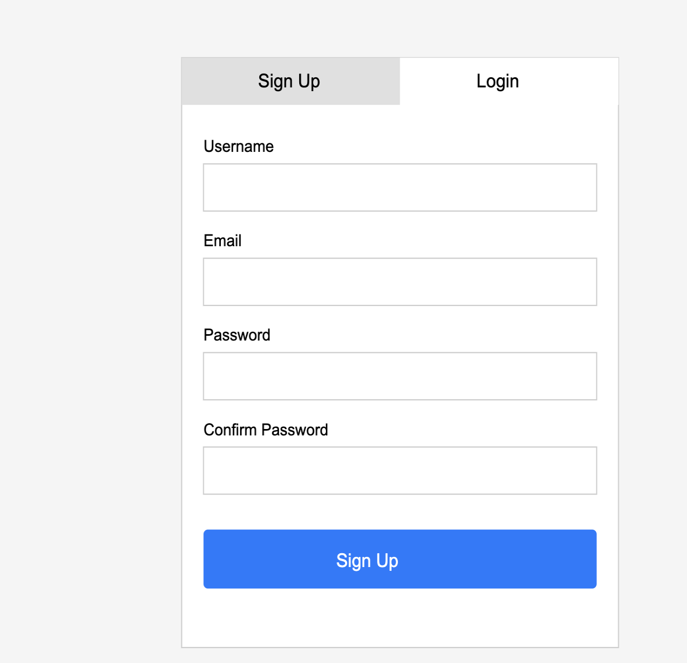
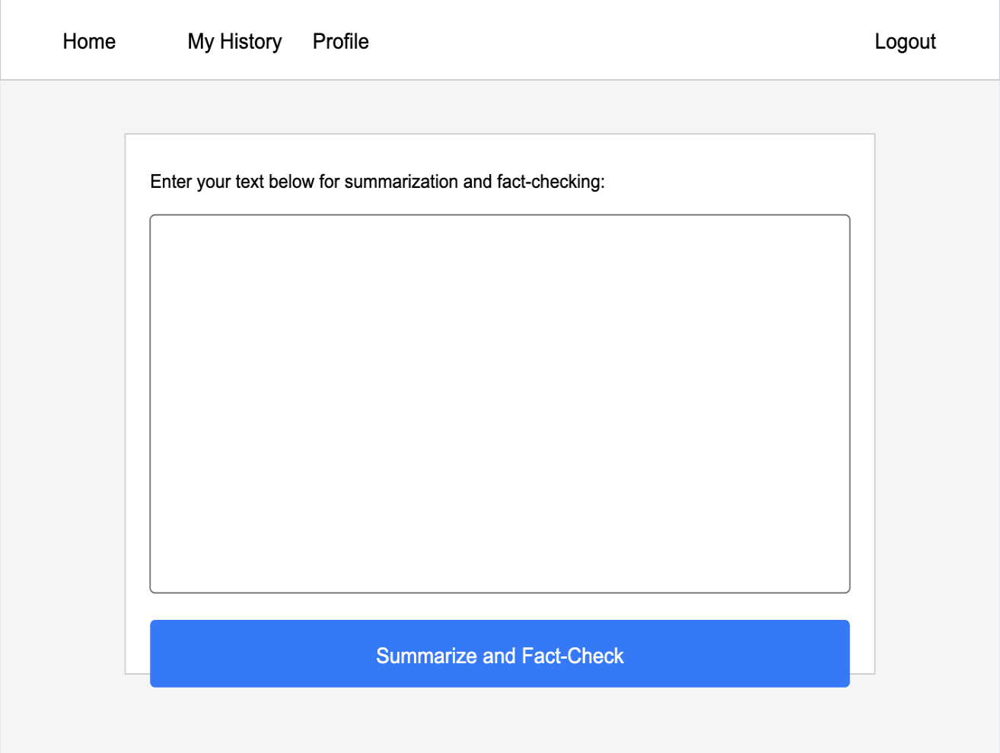
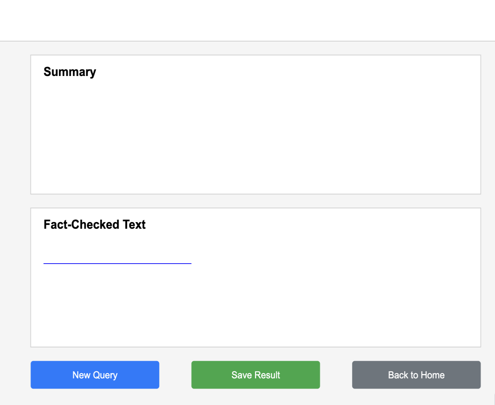
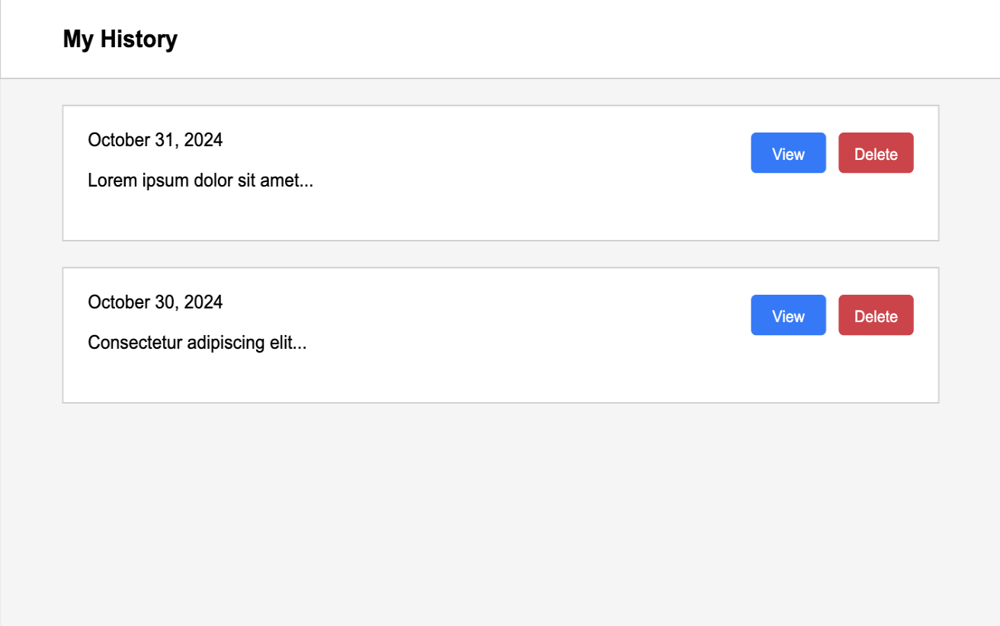
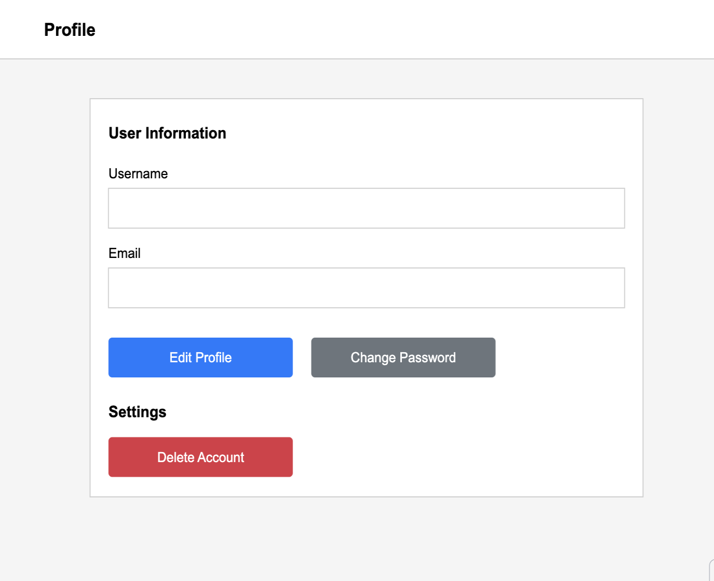
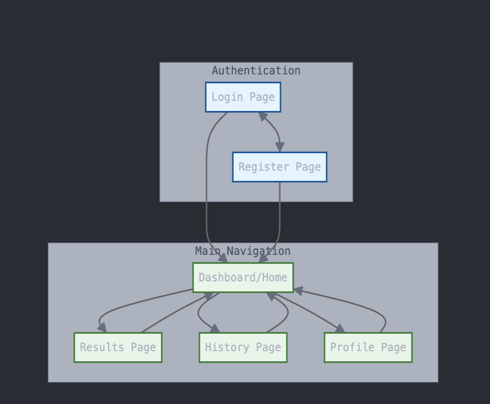

# Julian's Magic 8 Ball Of Knowledge

## Overview

We've all had times when we had to read long segments of text and understand them quickly. Additionally, we have to assess the accuracy of much of what we read online these days. While many solutions to summarize text are appearing these days, none simultaneously assess the validity of those texts and proivide guidance for how they should be regarded.

Enter Julian's Maghic 8 Ball Of Knowledge. This webapp will help users interpret large amounts of text and verify the accuracy of that information. This application will utilize the OpenAI API to interpret and summarize long text inputs, and will fact check them before providing the analysis to the user. User's will be able to see their past queries and refer to the fact checking.


## Data Model

The application will store Users and Queries

* Users will have account information and a list of their queries
* Queries will have the original text, summary, fact-checked text, date of creation, user, and qualitatuve score of accuracy.
* Queries will optionally have a url if the user chose to fact check an article from the web

(__TODO__: sample documents)

Example User:

```javascript
{
  "_id": ObjectId("615c1b8e8f1b2c6f9d3a4e2a"),
  "username": "jsinger03",
  "email": "jsinger03@gmail.com",
  "password": "$2b$10$abc123hashedpasswordexample",
  "queries": [
    ObjectId("615c1b9f8f1b2c6f9d3a4e2b")
  ]
}
```

Example Query with user, original text, summary, and fact checking:

```javascript
{
  "_id": ObjectId("615c1b9f8f1b2c6f9d3a4e2b"),
  "user": ObjectId("615c1b8e8f1b2c6f9d3a4e2a"), //jsinger03
  "originalText": "The Eiffel Tower was constructed in 1856 and is located in Berlin. It stands at 1,063 feet tall and was the world's tallest structure until 1930.",
  "summary": "The Eiffel Tower, built in 1887 in Paris, is 1,063 feet tall and was the world's tallest structure until 1930.",
  "factCheckResult": [
    {
      "textSegment": "constructed in 1856",
      "suggestion": "The Eiffel Tower was constructed between 1887 and 1889.",
      "startIndex": 25,
      "endIndex": 43
    },
    {
      "textSegment": "located in Berlin",
      "suggestion": "The Eiffel Tower is located in Paris.",
      "startIndex": 57,
      "endIndex": 73
    }
  ],
  "accuracyScore":30,
  "createdAt": ISODate("2023-11-01T12:00:00Z")
}
```

## [Link to Commented First Draft Schema](db.mjs) 

## Wireframes

/login - a page for registering for the site or logging in



/dashboard - the main page where users can navigate to their profile or history, and can submit text for processing



/results - a page to display the result of the text processing



/history - a page for users to see a list of their past queries and select one to view the results of, or delete the entry for



/profile - a page for users to modify their username and email, and to change their password



## Site map



## User Stories or Use Cases

1. as non-registered user, I can register a new account with the site
2. as a user, I can log in to the site
3. as a user, I can submit a text prompt to the site and view its summary and fact-checking
4. as a user, I can view all of my past queries
5. as a user, I can review in detail a past query
6. as a user, I can delete a past query
7. as a user, I can change my username, email, or password
8. as a user, I can submit a url for an article I would like to fact check

## Research Topics

* (6 points) React
  * I'm going to use React to implement UI that allows for dynamic response to user input
  * React will serve as the front-end while express handles the back-end API, authentication, and database usage
  * React Router will allow users to navigate pages without fully reloading them
* (2 points) OpenAI API Integration
  * OpenAI's API allows users to make calls to OpenAI LLM models directly from their programs
  * I am going to use OpenAI's API to handle the summarizing of user input and fact checking said input
* (2 points) Sass / Tailwind CSS (I'm undecided as to which I want to use)
  * I am going to use Sass or Tailwind CSS to make the CSS styling of my site more advanced
  * Leaning towards Tailwind as it will allow me to handle styling within the HTML files 
* (5 points) Server-side web scraping
  * In order to allow user's to submit urls for articles to be fact checked, I need to scrape the content
  * I will use Axios to get the content from the url
  * I will use readability from Mozilla's Readability library to parse the extracted html and find the article content
  * I will have to verify user inptu and validate it, as well as handle issues like when the site doesnt allow scraping


15 points out of 10 required points

## [Link to Initial Main Project File](app.mjs) 


## Annotations / References Used

1. [Sass Guide](https://sass-lang.com/guide/) - (code will be linked if/when implemented)
2. [React tutorial for beginners](https://www.youtube.com/watch?v=w7ejDZ8SWv8) - (code will be linked if/when implemented)
3. [Tailwind docs](https://tailwindcss.com/docs) - (code will be linked if/when implemented)
4. [OpenAI Node API Library](https://github.com/openai/openai-node) - (Code will be linked when implemented)
5. [OpenAI API Guide](https://platform.openai.com/docs/quickstart) - (Code will be linked when implemented)
6. [Axios Guide](https://axios-http.com/docs/intro)
7. [Axios Crash Course](https://www.youtube.com/watch?v=6LyagkoRWYA)
8. [Readability](https://www.npmjs.com/package/@mozilla/readability)